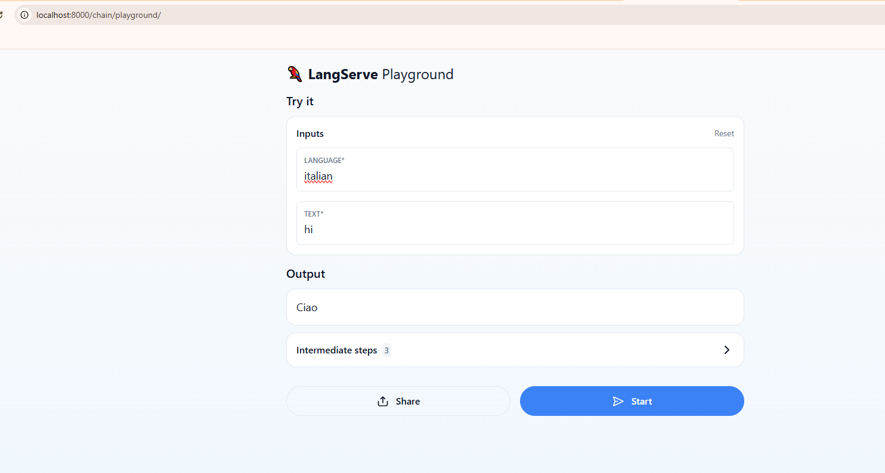

# RAGCHATGPTLIVE

This project is a simple translation application using LangChain and OpenAI's GPT-4 model, hosted on a FastAPI server. It allows users to send text to the server, specifying a target language, and receive translated text in response.


## Getting Started

These instructions will get you a copy of the project up and running on your local machine for development and testing purposes.

### Prerequisites

You need to install the following tools and configure their dependencies:

1. **Java** (versions 3.12.3)
    ```sh
    python --version
    ```
    Should return something like:
    ```sh
    Python 3.12.3
    ```

2. **Git**
    - Install Git by following the instructions [here](http://git-scm.com/book/en/v2/Getting-Started-Installing-Git)

    Verify the installation:
    ```sh
    git --version
    ```
    Should return something like:
    ```sh
    git version 2.2.1
    ```

3. **Dependencias adicionales, como ipykernel para Jupyter Notebooks.**

### Installing

1. Clone the repository and navigate into the project directory:
    ```sh
    git clone https:https://github.com/Richi025/RAGCHATGPTLIVE 
    cd RAGCHATGPTLIVE
    ```
2. Before running the application has to get a key to access the OpenIA API, and need replace in this line of the files langchainserver.py and langchainbasicapp:

    ```sh
    os.environ["OPENAI_API_KEY"] = "Insert your API"
    ```
3. **Run all comands of the langchainbasicapp.ipynb**

### Running the Application

To run, follow these steps:


1. **Run Server:**

    Open terminal and insert the follow comand.

    ```sh
    python langchainserver.py
    ```

    The backend will start on `http://localhost:8000/chain/playground/`, 

    

2. **Run client**

    Open terminal and insert the follow comand.

    ```sh
    python langchainserver.py
    ```

    

## Architectural Design


### Diagram Explanation

- **Client (`langchainclient.py`)**: Sends an HTTP request to the server to translate the text.
- **Server (`langchainserver.py`)**: Uses FastAPI to expose the `/chain` endpoint, invoking the LangChain processing chain.
- **LangChain**: The processing chain includes:
  - **ChatPromptTemplate**: Sets up the translation message.
  - **ChatOpenAI**: Executes the translation using the OpenAI API.
  - **StrOutputParser**: Processes the model's response and extracts the translated text.
- **OpenAI API**: Provides the translation through the selected model.

## Explanation of the program 

1. `langchainbasicapp.ipynb`  
This file sets up the environment and creates a basic translation chain:

**Package Installation**:
- `%pip install langchain` and `pip install -qU langchain-openai`: Installs LangChain and its OpenAI extension.

**API Configuration**:
- Defines the OpenAI API key as an environment variable to authenticate requests. However, exposing the API key directly in the code is a security risk. It’s recommended to use an external environment variable or a secure configuration file.

**Using the OpenAI Model**:
- Uses `ChatOpenAI` to load the GPT-4 model.
- Creates a message with `SystemMessage` to set the translation instruction and `HumanMessage` with the input text ("hi!").

**Parser and Chain**:
- Uses `StrOutputParser` to extract the translated text.
- Defines the processing chain `chain`, combining the model and the parser, then executes it.

**Message Templates**:
- Creates a `ChatPromptTemplate` to generalize the translation process, using `{language}` and `{text}` as parameters.
- Test run with language "Italian" and text "hi".

This file builds the basic logic for invoking the model and formatting input/output messages.

2. `langchainclient.py`  
This file acts as a client to send requests to a remote server:

**Server Connection**:
- Uses `RemoteRunnable` from `langserve` to invoke the processing chain hosted on a local server (`localhost:8000`).
- Sends a request with the language "Italian" and the text "hi" for translation.

3. `langchainserver.py`  
This file sets up an API server using FastAPI to run the processing chain remotely:

**FastAPI Setup**:
- Defines `FastAPI` to create a server that provides the translation chain as a service.

**Chain Configuration**:
- Creates a message template (`ChatPromptTemplate`) for translation, configures a `ChatOpenAI` model, and a `StrOutputParser`.
- Builds a chain with the template, model, and parser.

**API Routes**:
- Uses `add_routes` from `langserve` to register the chain at the `/chain` endpoint.
- When running the server (on `localhost:8000`), the client can access this route to request translations.

**Server Execution**:
- Uses `uvicorn` to start the server.

## Built With

* [Git](http://git-scm.com/) - Version Control System
* [LangChain](https://www.langchain.com/) - Framework for creating applications with large language models
* [FastAPI](https://fastapi.tiangolo.com/) - Web framework for building APIs with Python
* [OpenAI API](https://openai.com/api/) - API for accessing OpenAI's language models
* [Uvicorn](https://www.uvicorn.org/) - ASGI server for serving FastAPI applications

## Versioning

I use [GitHub](https://github.com/) for versioning. For the versions available, see the [tags on this repository](https://github.com/Sebasvasquezz/Mini-Twitter-MicroServices.git).

## Authors

* **Jose Ricardo Vasquez Vega** - [Richi025](https://github.com/Richi025)


## License

This project is licensed under the MIT License - see the [LICENSE.md](LICENSE.md) file for details.

## Date 

**07/11/2024**